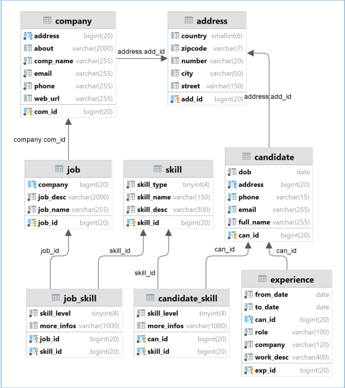
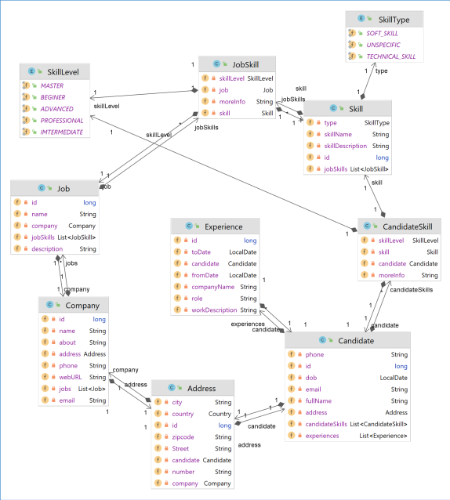
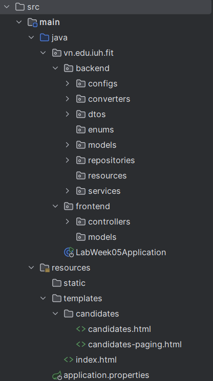
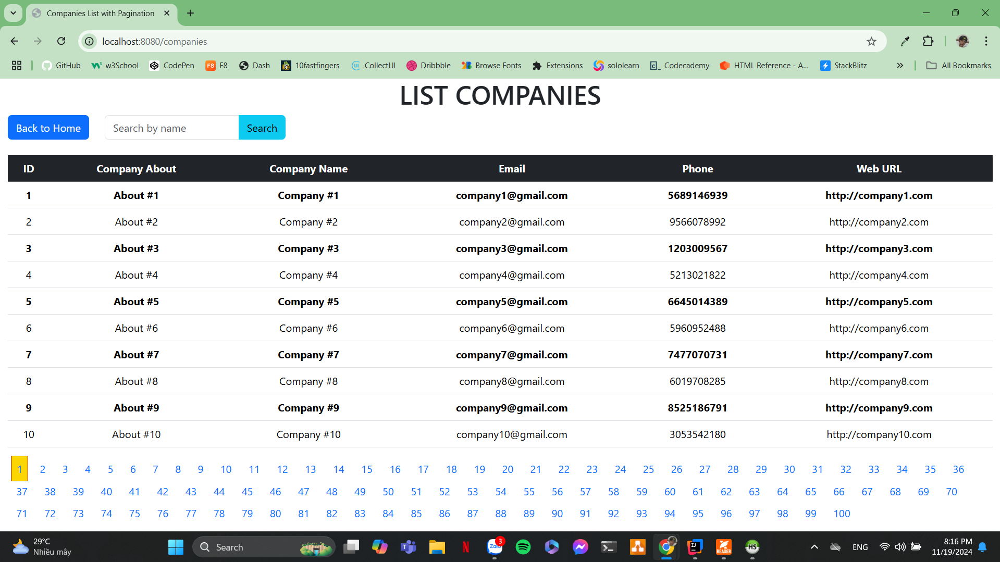
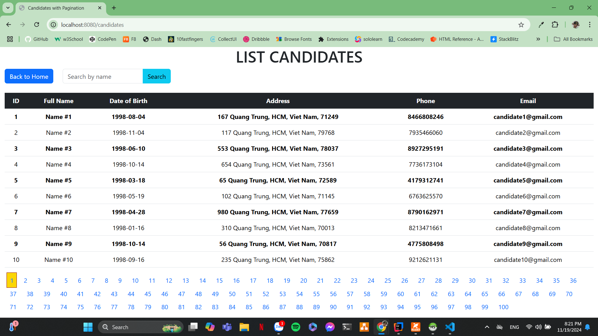

# TRANG WEB TUYỂN DỤNG

## I. Mô tả

**Mô tả:** Đây là một trang web xin việc làm cơ bản, cho phép các công ty đăng tin tuyển người, và các ứng viên khi đăng nhập vào sẽ được gợi ý các công việc phù hợp theo bản thân và có thể gửi mail hay thêm các đề xuất skill cho ứng viên.
 

## II. Nội dung

### [Tính năng](#tính-năng): Giúp tìm kiếm các công việc phù hợp với ứng viên cũng như đề xuất công việc, skill cho ứng viên

-   Quản lý danh các ứng viên, công ty, công việc có phân trang
-   Tích hợp API
-   Tìm kiếm công việc, skill phù hợp

### [Công nghệ sử dụng]

-   framework: Spring Boot
-   Thư viện: thymleaf, lombok
-   database: mariadb
-   Ngôn ngữ: Java
-   Các dependencies (Gradle):
    `implementation 'org.springframework.boot:spring-boot-starter-data-jpa'
implementation 'org.springframework.boot:spring-boot-starter-thymeleaf'
implementation 'org.springframework.boot:spring-boot-starter-web'
implementation 'org.springframework.boot:spring-boot-starter-web-services'
implementation 'org.mariadb.jdbc:mariadb-java-client:3.2.0'
compileOnly 'org.projectlombok:lombok'
developmentOnly 'org.springframework.boot:spring-boot-devtools'
annotationProcessor 'org.projectlombok:lombok'
//for country code
implementation 'com.neovisionaries:nv-i18n:1.29'
//For database REST
implementation 'org.springframework.data:spring-data-rest-core:4.1.4'
testImplementation 'org.springframework.boot:spring-boot-starter-test'
testImplementation 'org.springframework.security:spring-security-test'`

### [Cách sử dụng](#cách-sử-dụng)

1. Mở trang chủ tuyển dụng
2. Xem danh sách công ty, danh sách ứng viên, danh sách việc làm thông qua các button hay menu
3. ...

### [Cấu trúc thư mục](#cấu-trúc-thư-mục)

### Minh chứng

#### Trang home

#### Load dữ liệu có phân trang

### [Tác giả](#tác-giả)

-   Nguyễn Tấn Thái Dương
-   MSSV: 21049641
-   Giảng viên hướng dẫn: Võ Văn Hải
