# DỰ ÁN: WEB TUYỂN DỤNG VIỆC LÀM

- Link report word và presentation: https://drive.google.com/drive/u/0/folders/1i_2Q-yDOATkNWCyhemZmD3e6ltGHimE-

# Tác giả:

- Nguyễn Tấn Thái Dương
- MSSV: 21049641
- Giảng viên hướng dẫn: Võ Văn Hải

## Giới thiệu trang web

Đây là trang web giúp kết nối các ứng viên với các nhà tuyển dụng, hỗ trợ tìm việc phù hợp với từng cá nhân cũng như
giúp công ty tìm được người phù hợp với vị trí công việc.

## Công nghệ được sử dụng trong dự án

- Ngôn ngữ: HTML, CSS, JavaScript, Java
- frameword: Spring boot
- library: Thymleaf, lombok, Bootstrap 5
- Database: MariaDB

## Chức năng:

### Role: nhà tuyển dụng

1. Đăng thông tin công việc cần tuyển dụng
2. Chỉnh sửa thông tin công việc cần tuyển dụng
3. Tìm các ứng viên phù hợp với công việc
4. Xóa thông tin công việc cần tuyển dụng
5. Gửi lời mời tuyển dụng qua email
6. Chỉnh sửa thông tin nhà tuyển dụng
7. Tìm kiếm các bài đăng theo tên bài hoặc tên kỹ năng
8. Xem thông tin ứng viên đã ứng tuyển
9. Xem thông tin ứng viên đã được tuyển dụng

### Role: ứng viên

1. Tìm kiếm thông tin tuyển dụng
2. Xem thông tin chi tiết của công việc
3. Xem danh sách công việc phù hợp với ứng viên
4. Chỉnh sửa thông tin ứng viên
5. Gửi mail để ứng tuyển cho công việc
6. Đề xuất kỹ năng gợi ý cần học
7. Xem danh sách tất cả công việc đang tuyển dụng

### Giao diện

#### Danh sách Candidate No Paging

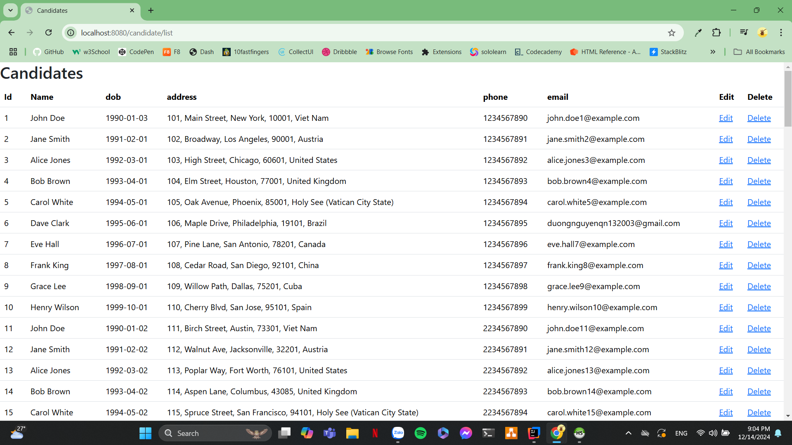

#### Danh sách Candidate Paging

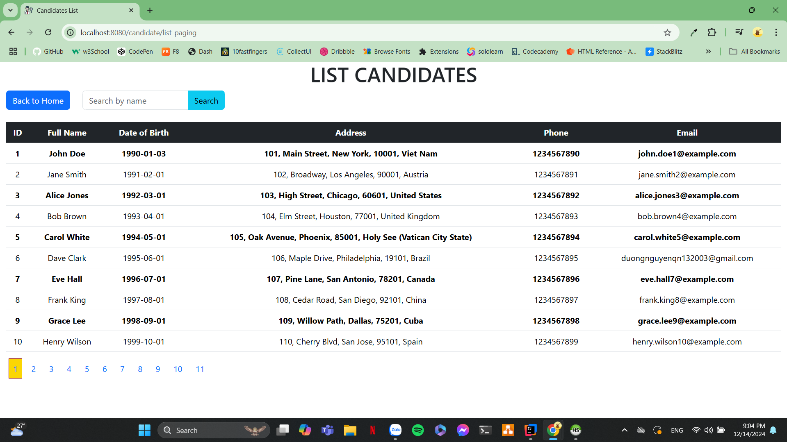

#### Trang chủ

- Hiển thị thông tin mặc định của trang web khi chưa đăng nhập là danh sách tất cả công việc đang được tuyển dụng
  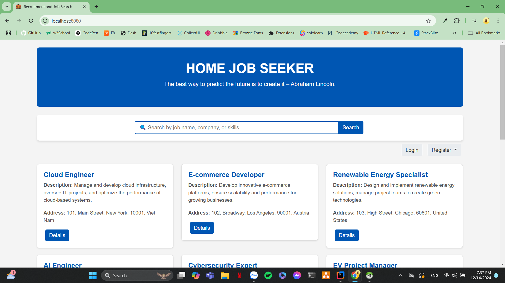

#### Trang đăng nhập

- Hiển thị trang đăng nhập cho phép người dùng đăng nhập tài khoản thực hiện các chức năng cụ thể khác
  

#### Trang đăng ký dành cho Candidate

- Hiển thị trang đăng ký dành cho Candidate, cho phép ứng viên tạo tài khoản
  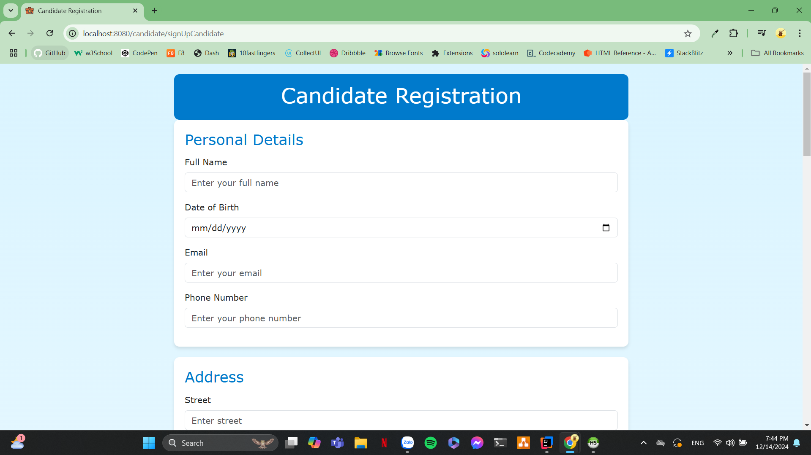

#### Trang đăng ký dành cho Company

- Hiển thị trang đăng ký dành cho Company, cho phép nhà tuyển dụng tạo tài khoản
  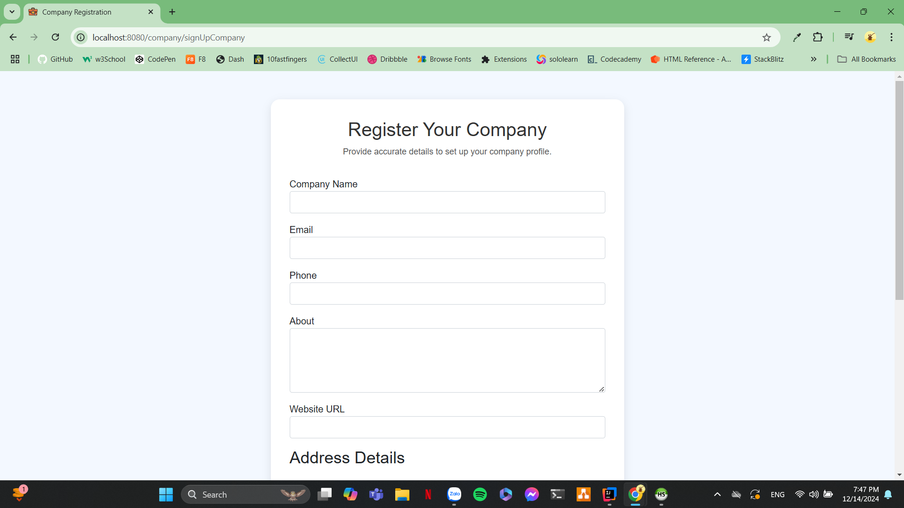

#### Trang chủ của Candidate

- Hiển thị trang chủ của Candidate khi đăng nhập thành công, cho phép ứng viên xem thông tin công việc phụ hợp và chỉnh
  sửa thông tin cá nhân cũng như xem kỹ năng đề xuất
  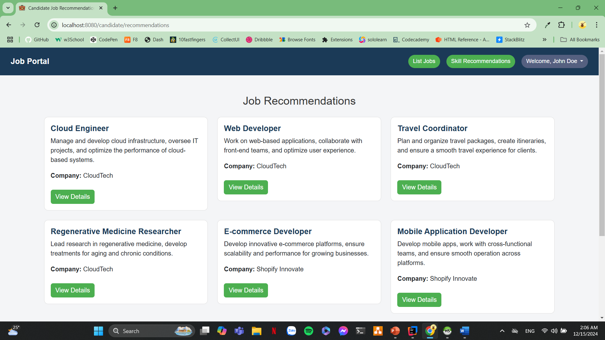

#### Trang xem danh sách tất cả các công việc đang tuyển dụng

- Hiển thị trang xem danh sách tất cả các công việc đang tuyển dụng, cho phép ứng viên xem thông công việc

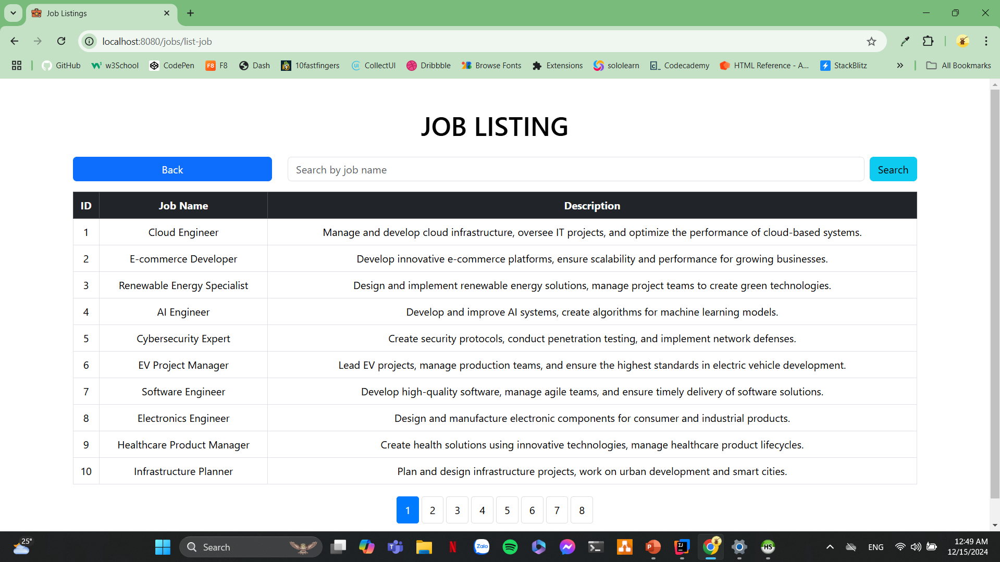

#### Trang chỉnh sửa thông tin của Candidate

- Hiển thị trang chỉnh sửa thông tin của Candidate, cho phép ứng viên chỉnh sửa thông tin cá nhân
  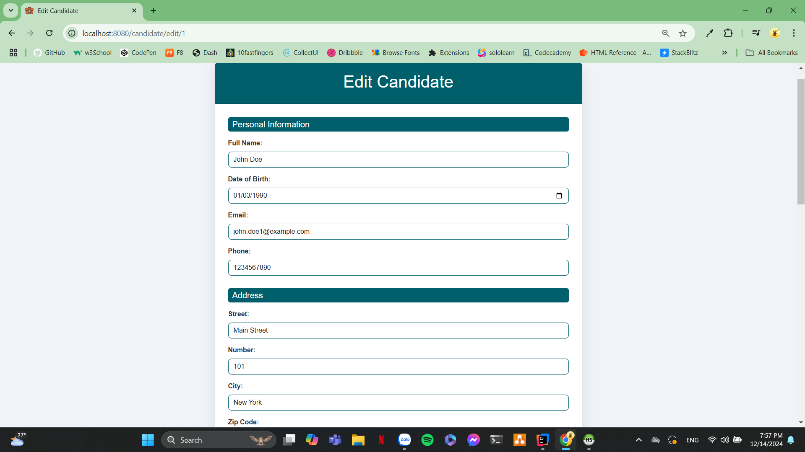

#### Trang đề xuất kỹ năng cần học

- Hiển thị trang đề xuất kỹ năng cần học, cho phép ứng viên xem kỹ năng cần học
  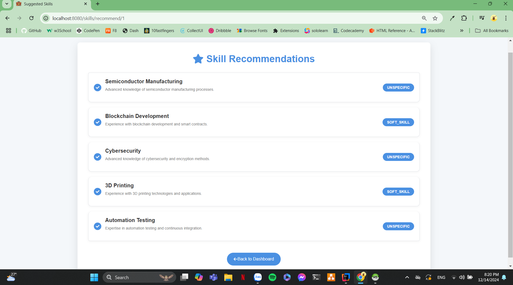

#### Trang chi tiết công việc

- Hiển thị trang xem thông tin chi tiết của công việc, cho phép ứng viên apply công việc
  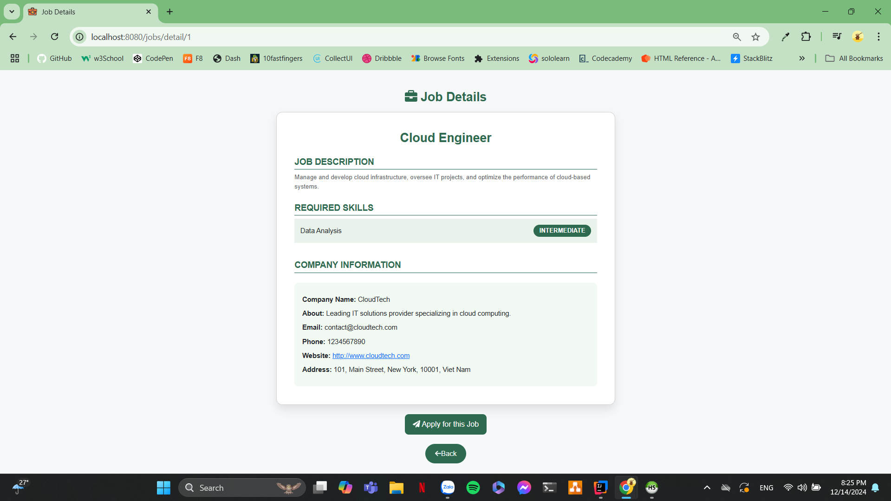

#### Trang ứng tuyển vào công việc

- Hiển thị thông tin và chi tiết đơn ứng tuyển để gửi email đến nhà tuyển dụng
  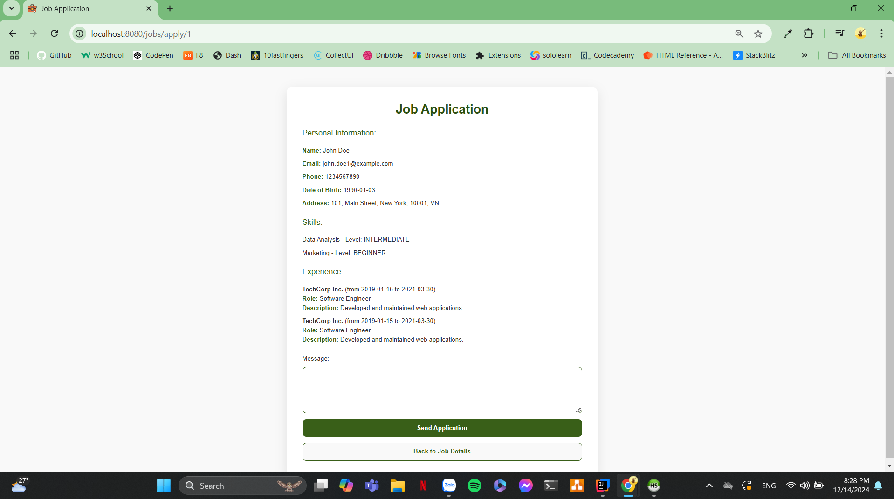

#### Trang chủ của Company

- Hiển thị trang chủ của Company khi đăng nhập thành công, cho phép nhà tuyền dụng xem danh sách công việc đã đăng tuyển
  dụng
  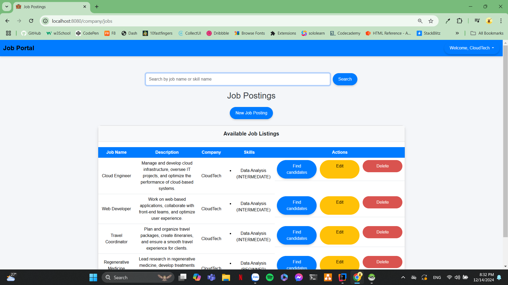

#### Trang chỉnh sửa thông tin của Company

- Hiển thị trang chỉnh sửa thông tin của Company, cho phép nhà tuyển dụng chỉnh sửa thông tin cá nhân
  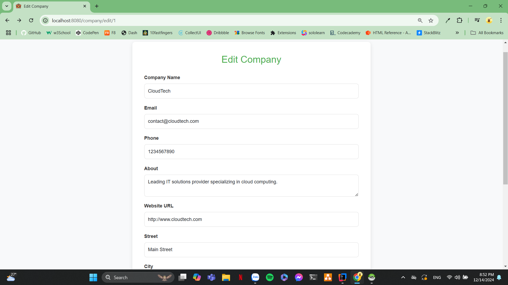

#### Trang chỉnh sửa thông tin công việc tuyển dụng

- Hiển thị trang chỉnh sửa thông tin công việc tuyển dụng, cho phép nhà tuyển dụng chỉnh sửa thông tin tuyển dụng
  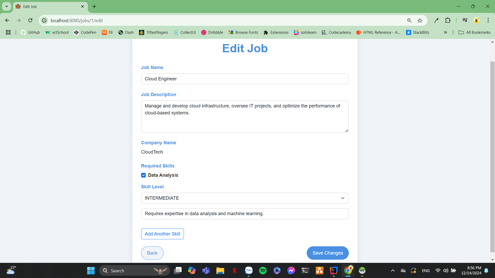

#### Trang hiển thị danh sách Candidate phù hợp cho công việc

- Hiển thị danh sách Candidate phù hợp cho công việc, cho phép nhà tuyển dụng mời ứng viên
  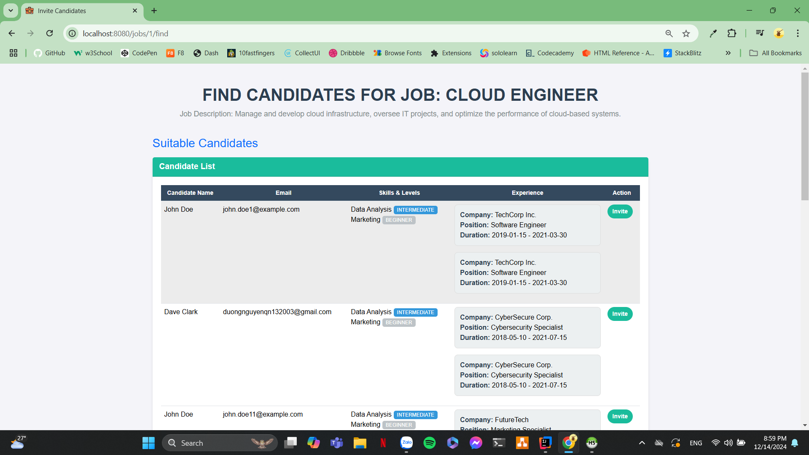

#### Trang đăng tuyển thông tin tuyển

- Hiển thị trang thêm mới công việc, cho phép nhà tuyển dụng đăng bài tuyển dụng mới

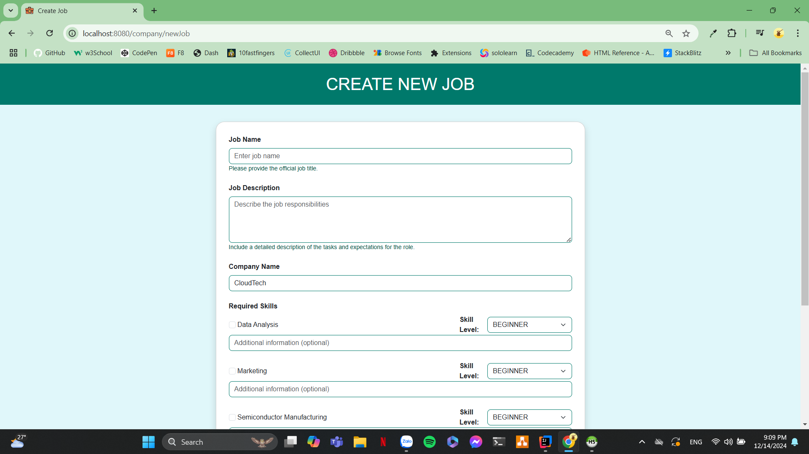
